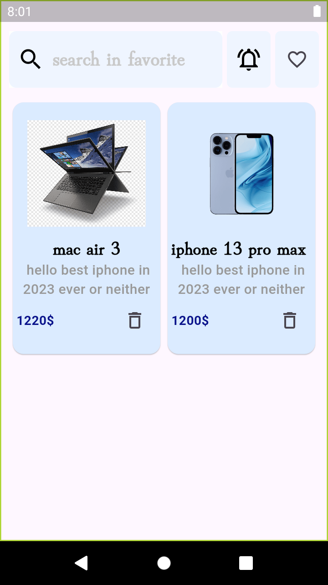
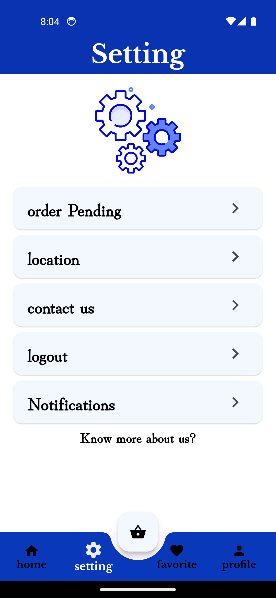
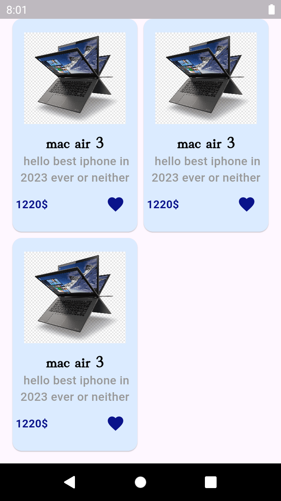
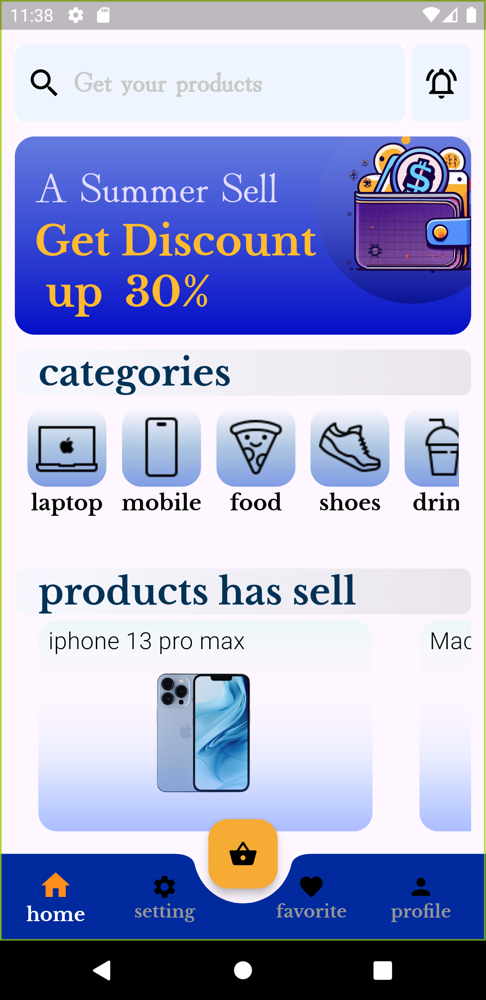
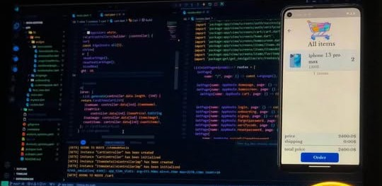

### 🛒 E-Commerce App (Legacy Project)

### 🚨 Developer's Note (Read First)

**Note to Recruiters & Reviewers:**
This was **the very first project** I ever built when I started my development journey years ago. I am hosting it here on GitHub for archival purposes and to showcase my career growth. The code, architecture, and patterns used here reflect my skills *at that time* (as a beginner) and do not represent my current technical proficiency, clean code standards, or modern architectural practices. 

### 📌 Project Overview

This is a full-featured E-Commerce mobile application that I developed independently in my early days. Although the backend services are no longer active (legacy APIs are lost), the frontend remains a testament to where my coding journey began. 

### 🏗️ Architecture & State Management

At the time of development, this project was structured using: 

* **Architecture Pattern:** MVC (Model-View-Controller) – implemented to practice separating business logic from the UI.
* **State Management:** [GetX](https://pub.dev/packages/getx) – used for handling reactive state, dependency injection, and basic routing.

### ✨ Features Implemented (Frontend)

* User Authentication UI (Sign Up / Login).
* Product Detailed View.
* Shopping Cart management (Add/Remove/Update items).
* Mock checkout and order summary screens.
* order with ability to choose your location
* ability to see the order details before confirming
* cart screen shows all details of your order price, quantity

### ⚙️ Tech Stack

* **Framework:** Flutter / Dart
* **State Management & Routing:** GetX
* **Design Pattern:** MVC

### 📈 What I Would Do Differently Today

Looking back at this codebase with my current experience, I would refactor it entirely by implementing: 

1. **Modern Architecture:** Moving from MVC to Clean Architecture or BLoC/Riverpod for strict separation of concerns, scalability, and better testability.
2. **Robust Error Handling:** Implementing proper try-catch blocks, generic API response handlers, and failure states.
3. **Solid Principles:** Refactoring bulky controllers into single-responsibility use cases.
4. **Unit & Integration Testing:** Writing comprehensive tests to ensure reliability.

*Thank you for taking the time to review my growth! Feel free to check out my recent repositories to see my current coding standards and advanced projects.*
## 📱 Screenshots

  <!-- الصف الأول (4 صور) -->
  
  
   
     <!-- هذا الوسم يقوم بإنشاء سطر جديد وفصل الصفين -->

  <!-- الصف الثاني (4 صور) -->
  
  
  
  

